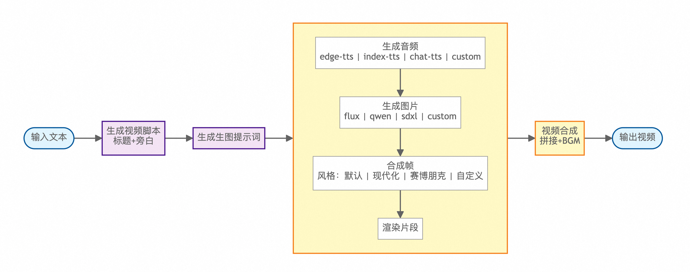

<h1 align="center">Pixelle-Video 🎬</h1>

<p align="center"><a href="README_EN.md">English</a> | <b>中文</b></p>

<p align="center">
  <a href="https://github.com/AIDC-AI/Pixelle-Video/stargazers"></a>
  <a href="https://github.com/AIDC-AI/Pixelle-Video/issues"></a>
  <a href="https://github.com/AIDC-AI/Pixelle-Video/network/members"></a>
  <a href="https://github.com/AIDC-AI/Pixelle-Video/blob/main/LICENSE"></a>
</p>

<h3 align="center">🚀 AI 全自动短视频引擎</h3>

只需输入一个 **主题**，Pixelle-Video 就能自动完成：
- ✍️ 撰写视频文案
- 🎨 生成 AI 配图  
- 🗣️ 合成语音解说
- 🎵 添加背景音乐
- 🎬 一键合成视频


**零门槛，零剪辑经验**，让视频创作成为一句话的事！

---

## ✨ 功能亮点

- ✅ **全自动生成** - 输入主题，自动生成完整视频
- ✅ **AI 智能文案** - 根据主题智能创作解说词，无需自己写脚本
- ✅ **AI 生成配图** - 每句话都配上精美的 AI 插图
- ✅ **AI 生成语音** - 支持 Edge-TTS、Index-TTS 等众多主流 TTS 方案
- ✅ **背景音乐** - 支持添加 BGM，让视频更有氛围
- ✅ **视觉风格** - 多种模板可选，打造独特视频风格
- ✅ **灵活尺寸** - 支持竖屏、横屏等多种视频尺寸
- ✅ **多种 AI 模型** - 支持 GPT、通义千问、DeepSeek、Ollama 等
- ✅ **原子能力灵活组合** - 基于 ComfyUI 架构，可使用预置工作流，也可自定义任意能力（如替换生图模型为 FLUX、替换 TTS 为 ChatTTS 等）

---

## 📊 视频生成流程

Pixelle-Video 采用模块化设计，整个视频生成流程清晰简洁：



从输入文本到最终视频输出，整个流程简洁清晰：**文案生成 → 配图规划 → 逐帧处理 → 视频合成**

每个环节都支持灵活定制，可选择不同的 AI 模型、音频引擎、视觉风格等，满足个性化创作需求。

---

## 🎬 视频示例

以下是使用 Pixelle-Video 生成的实际案例，展示了不同主题和风格的视频效果：

<table>
<tr>
<td width="33%">
<h3>📚 知识科普类</h3>
<video src="https://github.com/user-attachments/assets/4687df95-dd21-4a7b-b01e-f33a7b646644" controls width="100%"></video>
<p align="center"><b>养生知识</b></p>
</td>
<td width="33%">
<h3>💡 个人成长类</h3>
<video src="https://github.com/user-attachments/assets/d354465e-3fa8-40b4-93e9-61ad75ef0697" controls width="100%"></video>
<p align="center"><b>如何提升自己</b></p>
</td>
<td width="33%">
<h3>🤔 深度思考类</h3>
<video src="https://github.com/user-attachments/assets/663b705a-2aea-44bc-b266-4bb27aa255a8" controls width="100%"></video>
<p align="center"><b>如何理解反脆弱</b></p>
</td>
</tr>
<tr>
<td width="33%">
<h3>🌅 情感类</h3>
<video src="https://github.com/user-attachments/assets/1bad9a49-df83-4905-9cc8-9a7640e9c7d8" controls width="100%"></video>
<p align="center"><b>冬日暖阳</b></p>
</td>
<td width="33%">
<h3>📖 小说解说类</h3>
<video src="https://github.com/user-attachments/assets/8ac21768-41ce-4d41-acdd-e3dd3eb9725a" controls width="100%"></video>
<p align="center"><b>斗破苍穹</b></p>
</td>
<td width="33%">
<h3>🏛️ 历史文化类</h3>
<video src="https://github.com/user-attachments/assets/56e0a018-fa99-47eb-a97f-fc2fa8915724" controls width="100%"></video>
<p align="center"><b>资治通鉴</b></p>
</td>
</tr>
</table>

> 💡 **提示**: 这些视频都是通过输入一个主题关键词，由 AI 全自动生成的，无需任何视频剪辑经验！

---

## 🚀 快速开始

### 前置环境依赖

在开始之前，需要先安装 Python 包管理器 `uv` 和视频处理工具 `ffmpeg`：

#### 安装 uv

请访问 uv 官方文档查看适合你系统的安装方法：  
👉 **[uv 安装指南](https://docs.astral.sh/uv/getting-started/installation/)**

安装完成后，在终端中运行 `uv --version` 验证安装成功。

#### 安装 ffmpeg

**macOS**
```bash
brew install ffmpeg
```

**Ubuntu / Debian**
```bash
sudo apt update
sudo apt install ffmpeg
```

**Windows**
- 下载地址：https://ffmpeg.org/download.html
- 下载后解压，将 `bin` 目录添加到系统环境变量 PATH 中

安装完成后，在终端中运行 `ffmpeg -version` 验证安装成功。

---

### 第一步：下载项目

```bash
git clone https://github.com/AIDC-AI/Pixelle-Video.git
cd Pixelle-Video
```

### 第二步：启动 Web 界面

```bash
# 使用 uv 运行（推荐，会自动安装依赖）
uv run streamlit run web/app.py
```

浏览器会自动打开 http://localhost:8501

### 第三步：在 Web 界面配置

首次使用时，展开「⚙️ 系统配置」面板，填写：
- **LLM 配置**: 选择 AI 模型（如通义千问、GPT 等）并填入 API Key
- **图像配置**: 如需生成图片，配置 ComfyUI 地址或 RunningHub API Key

配置好后点击「保存配置」，就可以开始生成视频了！

---

## 💻 使用方法

打开 Web 界面后，你会看到三栏布局，下面详细讲解每个部分：

---

### ⚙️ 系统配置（首次必填）

首次使用时需要配置，点击展开「⚙️ 系统配置」面板：

#### 1. LLM 配置（大语言模型）
用于生成视频文案的 AI。

**快速选择预设**  
- 通过下拉菜单选择预设模型（通义千问、GPT-4o、DeepSeek 等）
- 选择后会自动填充 base_url 和 model
- 点击「🔑 获取 API Key」链接去注册并获取密钥

**手动配置**  
- API Key: 填入你的密钥
- Base URL: API 地址
- Model: 模型名称

#### 2. 图像配置
用于生成视频配图的 AI。

**本地部署（推荐）**  
- ComfyUI URL: 本地 ComfyUI 服务地址（默认 http://127.0.0.1:8188）
- 点击「测试连接」确认服务可用

**云端部署**  
- RunningHub API Key: 云端图像生成服务的密钥

配置完成后点击「保存配置」。

---

### 📝 内容输入（左侧栏）

#### 生成模式
- **AI 生成内容**: 输入主题，AI 自动创作文案
  - 适合：想快速生成视频，让 AI 写稿
  - 例如：「为什么要养成阅读习惯」
- **固定文案内容**: 直接输入完整文案，跳过 AI 创作
  - 适合：已有现成文案，直接生成视频

#### 背景音乐（BGM）
- **无 BGM**: 纯人声解说
- **内置音乐**: 选择预置的背景音乐（如 default.mp3）
- **自定义音乐**: 将你的音乐文件（MP3/WAV 等）放到 `bgm/` 文件夹
- 点击「试听 BGM」可以预览音乐

---

### 🎤 语音设置（中间栏）

#### TTS 工作流
- 从下拉菜单选择 TTS 工作流（支持 Edge-TTS、Index-TTS 等）
- 系统会自动扫描 `workflows/` 文件夹中的 TTS 工作流
- 如果懂 ComfyUI，可以自定义 TTS 工作流

#### 参考音频（可选）
- 上传参考音频文件用于声音克隆（支持 MP3/WAV/FLAC 等格式）
- 适用于支持声音克隆的 TTS 工作流（如 Index-TTS）
- 上传后可以直接试听

#### 预览功能
- 输入测试文本，点击「预览语音」即可试听效果
- 支持使用参考音频进行预览

---

### 🎨 视觉设置（中间栏）

#### 图像生成
决定 AI 生成什么风格的配图。

**ComfyUI 工作流**  
- 从下拉菜单选择图像生成工作流
- 支持本地部署（selfhost）和云端（RunningHub）工作流
- 默认使用 `image_flux.json`
- 如果懂 ComfyUI，可以放自己的工作流到 `workflows/` 文件夹

**图像尺寸**  
- 设置生成图像的宽度和高度（单位：像素）
- 默认 1024x1024，可根据需要调整
- 注意：不同的模型对尺寸有不同的限制

**提示词前缀（Prompt Prefix）**  
- 控制图像的整体风格（语言需要是英文的）
- 例如：Minimalist black-and-white matchstick figure style illustration, clean lines, simple sketch style
- 点击「预览风格」可以测试效果

#### 视频模板
决定视频画面的布局和设计。

- 从下拉菜单选择模板，按尺寸分组显示（竖屏/横屏/方形）
- 点击「预览模板」可以自定义参数测试效果
- 如果懂 HTML，可以在 `templates/` 文件夹创建自己的模板

---

### 🎬 生成视频（右侧栏）

#### 生成按钮
- 配置好所有参数后，点击「🎬 生成视频」
- 会显示实时进度（生成文案 → 生成配图 → 合成语音 → 合成视频）
- 生成完成后自动显示视频预览

#### 进度显示
- 实时显示当前步骤
- 例如：「分镜 3/5 - 生成插图」

#### 视频预览
- 生成完成后自动播放
- 显示视频时长、文件大小、分镜数等信息
- 视频文件保存在 `output/` 文件夹

---

### ❓ 常见问题

**Q: 第一次使用需要多久？**  
A: 生成时长取决于视频分镜数量、网络状况和 AI 推理速度，通常几分钟内即可完成。

**Q: 视频效果不满意怎么办？**  
A: 可以尝试：
1. 更换 LLM 模型（不同模型文案风格不同）
2. 调整图像尺寸和提示词前缀（改变配图风格）
3. 更换 TTS 工作流或上传参考音频（改变语音效果）
4. 尝试不同的视频模板和尺寸

**Q: 费用大概多少？**  
A: **本项目完全支持免费运行！**

- **完全免费方案**: LLM 使用 Ollama（本地运行）+ ComfyUI 本地部署 = 0 元
- **推荐方案**: LLM 使用通义千问（成本极低，性价比高）+ ComfyUI 本地部署
- **云端方案**: LLM 使用 OpenAI + 图像使用 RunningHub（费用较高但无需本地环境）

**选择建议**：本地有显卡建议完全免费方案，否则推荐使用通义千问（性价比高）

---

## 🤝 参考项目

Pixelle-Video 的设计受到以下优秀开源项目的启发：

- [Pixelle-MCP](https://github.com/AIDC-AI/Pixelle-MCP) - ComfyUI MCP 服务器，让 AI 助手直接调用 ComfyUI
- [MoneyPrinterTurbo](https://github.com/harry0703/MoneyPrinterTurbo) - 优秀的视频生成工具
- [NarratoAI](https://github.com/linyqh/NarratoAI) - 影视解说自动化工具
- [MoneyPrinterPlus](https://github.com/ddean2009/MoneyPrinterPlus) - 视频创作平台
- [ComfyKit](https://github.com/puke3615/ComfyKit) - ComfyUI 工作流封装库

感谢这些项目的开源精神！🙏

---

## 📢 反馈与支持

- 🐛 **遇到问题**: 提交 [Issue](https://github.com/AIDC-AI/Pixelle-Video/issues)
- 💡 **功能建议**: 提交 [Feature Request](https://github.com/AIDC-AI/Pixelle-Video/issues)
- ⭐ **给个 Star**: 如果这个项目对你有帮助，欢迎给个 Star 支持一下！

---

## 📝 许可证

本项目采用 MIT 许可证，详情请查看 [LICENSE](LICENSE) 文件。

---

## ⭐ Star History

[](https://star-history.com/#AIDC-AI/Pixelle-Video&Date)

